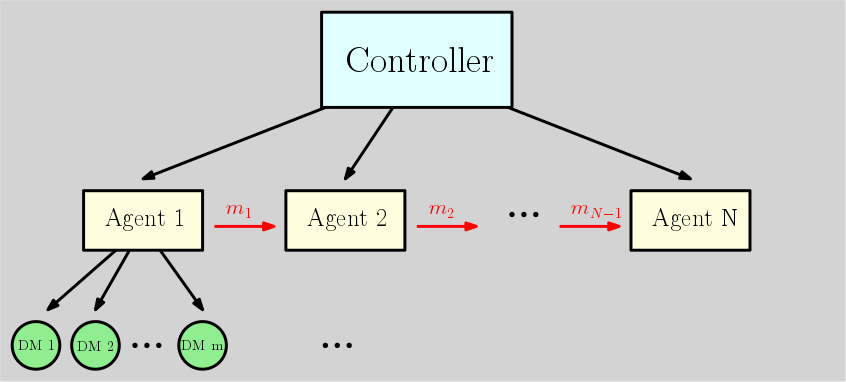

# CityLearn MAD CATS (Multi-Agent Distributed Control with Adequate Tree-Search)

> !!! Disclaimer: This repository is currently under development, so be patient with bugs.
  If you find any, please let us know (the contact info is below) !!!
 
> This repository contains the code for our implementation of a solution for the
 [2022 CityLearn challenge](https://github.com/intelligent-environments-lab/CityLearn).

<figure>

</figure>

## Introduction

The imposed problem is a multi-agent scenario, where the agents are the buildings in the smart-grid.
There is a battery in each building, which can be used to store energy, and a solar panel, which produces energy.
Each building has its own energy consumption and production, and the goal is to minimize the utility,
which is a specified measure of the net energy consumption of the buildings in the grid, 
parts of which are global to the whole district and parts of which are local to each building.
The action-space for each building is the amount of energy to be charged/discharged to the battery, which is continues in $[-1, 1]$, where $1$ and $-1$ stands for fully charge and fully discharge the battery respectively. The observation space is the
energy consumption and production of the building, as well as additional global parameters such as the 
electricity price, the $\text{CO}_2$ intensity per unit of electricity, the weather parameters, etc.

The crux of the problem is that:
- Each building's actions affect its future net consumption, so the net consumption of each building has to be predicted.
- The utility involves global parts, so the optimal action for one building depends on the actions of the other buildings.
- The natural periodicity of the net consumption is 24 hours, which for planning using tree-search 
  algorithms even with a moderate branching factors (i.e. 5) is intractable (e.g., $5^{24}=6\cdot 10^{17}$ ).

## Solution

The $i$'th building's net consumption at time $t$ is made out of three key elements:

$$E^{(i,t)} = E_\text{Load}^{(i,t)} + E_\text{Solar}^{(i,t)} + E_\text{Storage}^{(i,t)}$$

The non-shiftable load $E_\text{Load}^{(i,t)}$ and the solar generation $E_\text{Solar}^{(i,t)}$ terms are given from
the environment.
The storage $E_\text{Storage}^{(i,t)}$ is the action of the agent, which is the amount of energy to be
charged/discharged from the battery.

We can therefore factorize the problem into two sub-environments, one for the agent and one for the "world", where the
actions only affect the agent's environment, and the time-evolution is dictated by the world's environment.

The actions affect the net electricity consumption via the equation above, and accordingly affect the utility function.

We implement and use:

- Uniform-Cost Search algorithm (a type of tree-search), which is a modified 
[Dijkstra's algorithm](https://en.wikipedia.org/wiki/Dijkstra%27s_algorithm), to find the next optimal action for each building.
- Various predictors to predict the net consumption of each building for the next time frame (1 or 24 hrs)
- Battery model to translate action to change in battery's state.
- Local (instantaneous) estimation of the utility function to guide the search.
- Depth-selective search, where the search is performed only on specified levels of the tree, and the rest is 
  bridged by steps among which the action is uniformly divided.
- Some utility terms are global. Namely, they are effected by the actions of all the buildings in the district.
  We use decentralized controllers, where each building is taking actions to optimize local reward function.
  Therefore, a local estimation of the global utility is established and used to guide the search for each agent.
- Residual corrections between the sum of local trajectories and the global optimal behavior are taken care of by the last agent. 
  This is done by a simple heuristic, where it optimizes a global utility with the sum of net consumptions (modified with the planned actions). 

##### Etymology
Let's break down the name of the repository:
MAD CATS (Multi-Agent Distributed Control with Adequate Tree-Search)
- `CityLearn` is the name of the challenge, referring to the fact that there is a collective (city) learning goal.
- `Multi-Agent` is the type of problem, referring to the same thing basically.
- `Distributed Control` refers to the fact that the actions are performed in a distributed manner, 
   i.e., each agent has its own policy and own search tree which is independent of others.
- `Adequate Tree-Search` refers to the uniform-cost tree-search algorithm we use to solve the problem,
   with its extra spices that contribute efficiency, e.g., depth-selective search and non-uniform action space
   discretization, and to the fact that it is based on a battery model we employed, and use mixed decision-makers for
   the decentralized controllers.

### Formulating the Battery problem as an MDP

In order to use search algorithms such as Uniform-Cost-Search (UCS) we need to have a model of the world as a 
Markov Decision Process (MDP), that we can use for offline planing. The given CityLearn environment, as we already
mentioned, can be factored into two parts:
- The **Grid** model, which consists of the weather parameters (e.g. temperature, solar irradiance, etc.), 
  the grid parameters (e.g. electricity price, carbon intensity, etc.) and the buildings' electricity measured data 
  (e.g. non-shiftable load and solar generation).
- The **Battery** model, which consists of the battery's State of Charge (SoC), Capacity, Nominal-Power and so on.
Therefore, we formulate the model of the battery as an MDP and together with a predictor that predicts the future 
  behaviour of the grid and each building's electricity consumption and production, we use UCS to find the best plan of 
  battery actions from each state for each building.
  
The battery MDP $\langle S, A, T, R, \gamma\rangle$ we use is the following:
- $S$ is composed of the battery state such that at time step $t$, $s_t  = (SoC_{t} - SoC_{t-1}, SoC_{t}, Capacity_{t})$.
- $A$ is defined as some discritization of the continuous action space $[-1, 1]$, i.e. $[-1.0, -0.5, -0.1, 0, 0.1, 0.5, 1.0]$.
- $T$ is given by the physical model of the battery, taken from the CityLearn environment.
- $R$ is a local reward function (cost function in our case) which was handcrafted in a way that would be globally consistent with the CityLearn's 
  utility (explained in detail later). 
  
The goal here is to find a trajectory of battery's charge/discharge actions with minimal cost given a set of world 
predictions and then execute the single first or the first few actions from that trajectory, and then re-plan.   

#### Timescales in the problem

Before delving into further details, it is important to focus on the different timescales which motivated our solution.

- Each action is taken for a time frame of 1 hour, and the environment is updated every hour, so this is the immediate
  timescale to predict and act upon.

- The basic operational timescale is the 24-hour cycle, which is the natural periodicity of the net consumption of the
  buildings, as  the generation peak occurs at about noon, and the consumption peak occurs during the evening.
  This timescale is also the timescale of the electricity price, and the carbon intensity, which constitute the global
  utility terms.

The gap between these two timescales is the main challenge of the problem, and the reason why we are to use tree-search algorithms to find the optimal action for each building.

- The long-term timescale is the whole year, which is the timescale of the data we have to train our decision-makers on.
  
- Intermediate timescales, like the one-month used in the load factor utility term or the long drifting time of the
  weather are not considered in our solution, as they are not relevant to the immediate action of the agent.

### Battery model

We reverse-engineered the battery model from the `CityLearn` environment, and used it as the MDP's (Markov decision process)
transition function for the planning as mentioned above.

The key parameters of the model are the battery's capacity, the battery's charging and discharging efficiency, and the battery's nominal power.

> copy from overleaf

### Local utility estimation

The utility is a function of the net consumption ( $E$ ), that is only evaluated at the end of the year (episode).
However, the predictions and actions are made at each step, so we need to estimate the utility at each step.
For this purpose, we use an instantaneous utility estimation, which is an approximation of the utility function.

To motivate the construction of the instantaneous utility function, we first observe the utility function as a
function of the net consumption, as it is defined in the CityLearn 2022 challenge environment.

The utility is a weighted sum of four terms: 

$$ U=\frac{1}{3}\frac{P}{P_{0}}+\frac{1}{3}\frac{C}{C_{0}}+\frac{1}{6}\frac{R}{R_{0}}+\frac{1}{6}\frac{L}{L_{0}}, $$

Where $P$ is the district's electricity price cost, $C$ is the district's $\text{CO}_2$ emission, $R$ is the ramping factor,
and $L$ is the load factor. All explained below.
Each term is normalized by the baseline cost (with subscript $0$ ), which is the cost of the district without battery usage,
that is equivalent to consecutive no-op actions.

Next, let us break down each one of the utility terms.

#### Electricity cost:

$$ P=\sum_{t=0}^{8759}\alpha_P (t)\left\lfloor\sum_{t=0}^4 E^{(i,t)}\right\rfloor_0 $$

Here $\alpha_P (t)$ is the electricity price at time $t$ (given from the environment), and $E^{(i,t)}$ is the net
consumption of the $i$'th building at time $t$. The $\left\lfloor\cdot\right\rfloor _{0}$ annotates the positive part
of the sum over all buildings (5 in the training set, but not necessarily 5 in the other sets).

Note that this part of the utility can be directly decomposed into the sum of instantaneous utilities at each
time-step (and be rewritten as a dot-product), but a global knowledge of the district's net consumption is required
to execute the ReLU.

To approximate this global trend, we use a leaky ReLU, where the slope of the negative part is a parameter, which
we set to $\beta_P\approx 0.16$ according to the training set's statistics (without battery usage).

$$ P\approx\sum_{t=0}^{8759}\sum_{t=0}^{4}P^{\left(i,t\right)}\text{ },\quad\text{ with }\quad\tilde{P}^{\left(i,t\right)}
=\alpha_{P}(t)\left(\left\lfloor E^{(i,t)}\right\rfloor_{0}+\beta_{P}\left\lceil E^{(i,t)}\right\rceil _{0}\right)\text{ }, $$

where $\left\lceil\cdot\right\rceil_{0}$ denotes the negative part.

This approximation only applies to the local utility estimation.

#### Carbon emission:

$$ C=\sum_{t=0}^{8759}\sum_{t=0}^{4}\tilde{C}^{\left(i,t\right)}\text{ },\text{ },\quad\text{ with }\quad \tilde{C}^{\left(i,t\right)}
=\alpha_{C}(t)\left\lfloor E^{(i,t)}\right\rfloor _{0}\text{ }. $$

Here $\alpha_{C}(t)$ is the given carbon intensity at time $t$, and we readily decomposed this term into the sum of
local and instantaneous utilities.

#### Ramping:

$$ R=\sum_{t=0}^{8759}\left|\sum_{i=0}^{4}\left[E^{(i,t)}-E^{(i,t-1)}\right]\right| $$

Similarly to the price term, this part of the utility can be directly decomposed into the sum of instantaneous
 utilities, but a global knowledge of the district's net consumption is required to execute the absolute value.
    
To approximate this, we use a factored ReLU, with a scaling factor $\beta_R\approx 0.75$ set according to the
training set's statistics.

$$P\approx\sum_{t=0}^{8759}\sum_{t=0}^{4}P^{\left(i,t\right)}\text{ },\quad\text{ with }\quad P^{\left(i,t\right)}
=\alpha_{P}(t)\left(\left\lfloor E^{(i,t)}\right\rfloor _{0}+\beta\left\lceil E^{(i,t)}\right\rceil _{0}\right)\text{ }.$$

$$R\approx\sum_{t=0}^{8759}\sum_{t=0}^{4}R^{\left(i,t\right)}\text{ },\quad\text{ with }\quad R^{\left(i,t\right)}
=\alpha_{R}(t)\left(\left\lfloor E^{(i,t)}-E^{(i,t-1)}\right\rfloor_{0}+\beta_{R}\left\lceil E^{(i,t)}-E^{(i,t-1)}\right\rceil _{0}\right)\text{ }.$$

Once again, this approximation only applies to the local utility estimation.

#### Load factor:

$$ L=1-\frac{1}{8760}\sum_{m=0}^{11}\frac{\Sigma_{t=0}^{729}\Sigma_{i=0}^{4}E^{\left(i,730m+t\right)}}{\max
\left[\Sigma_{i=0}^{4}E^{\left(i,730m+t\right)}\right]_{t=0}^{729}}\text{ }. $$

This is somewhat cumbersome term, but let's break it down intuitively.
In the numerator, we have a sum of the net consumption over all (730) time-steps of the month $m$, and in the denominator,
we have the maximum (peak) value.
This means that this part of the utility penalizes the peak consumption, and rewards the average consumption.
To see this, we observe that wherever action we take, the sum of consumption over a whole month is more or less 
anyway given by the load-to-generation difference, and the peak consumption is the only thing that can be changed
by the action, due to the relatively small timescale at which the battery can get drained or charged.
So, higher peak consumption means larger denominators, so lower arguments of the summation, but the leading minus
sign in the utility function means that this is penalized to be higher utility.

To approximate this term, we take a heuristic approach, where we use the median and max consumption of the no-op
trajectory over each month as a proxy for penalizing high (candidate peak) consumptions.

$$ L\approx\sum_{m=0}^{11}\sum_{t=0}^{729}\sum_{t=0}^{4}\tilde{L}^{\left(i,t,m\right)}\text{ },\text{ },\quad\text{ with }\quad
\tilde{L}^{\left(i,t,m\right)}=\beta_{L}\left[\exp\left(\frac{\left\lfloor E^{\left(i,730m+t\right)}-\mu_{1/2}^{m}
\right\rfloor_0}{M^m-\mu_{1/2}^m}\right)-1\right]\text{ }, $$

where $\mu_{1/2}^m$ is the median of the no-op trajectory over the month $m$, and $M^m$ is its maximum, and
$\beta_L\approx 84$ is a scaling factor set according to the training set's statistics.
The large difference between the scaling factors stems from the different approach and also from the fact that in the
utility the different terms are arbitrarily summed over or taken the average of. In part this scaling factor does not
matter per se, as each utility term is normalized by the no-op utility, but it is set to match the original 
utility scale. It is also varied for the global utility estimation.

For the hierarchical control we evaluate a couple of estimators.
The first one uses only local utilities for a single building, independent of the other buildings.
The second one uses the net consumption of the whole district, using the actions of the previous agents and 
no-op's as estimations for the missing next buildings.

### Decentralized control scheme with directional information

We use a decentralized control setting for all agents, where each building has its own set of decision-makers.
The last agent is knowledgeable about the rest of the agents (net consumptions modified by the planned actions),
and can use this information to make better decisions in the context of the group.

<figure>

</figure>
> 

### Depth-selective search

## Alternative Rule-based solution
A set of rules defines the next move for each building independently (locally), based on the next hour prediction.
The rules were defined to "flatten" the net consumption curve (closing the temporal gap / phase-shift between 
peak production and peak demand), and by this to minimize the utility:
- If the next hour production is higher than the consumption, the battery is charged by the extra amount.
- If the next hour consumption is higher than the production, the battery is discharged by the missing amount.

On top of that, the rules treat the cases where the battery is fully charged or fully discharged.
We also penalize the battery charge, in hours when the carbon intensity is below its median,
as in such times the utility for using the grid power is relatively lower.

The rules are defined in two cases, for a single building and for a group of buildings.
The essence is the same, just that for the later case, the input is the net consumption of the group.

Additional tuning was done to the rules, to minimize the utility for the training set, and the parameters for the
single and group rules were found to be different.
An important hyperparameter is thus the number of buildings which use the group rules.

<figure>

</figure>

> Rule-based solution for a single building

## Tunable parameters

Controller parameters:
- `random_order`: Whether to choose the order of the buildings randomly each time-step or not.
- `prediction_method`: The method to use for predicting the net consumption of each building. Choose from:
  - `IDX`: Use the time and building indices for perfect prediction over the training set.
  - `CSV`: Load the predictions from a CSV file.
  - `DOT`: Generate prediction by finding the maximal dot-product overlap of the past 24hr consumption and training data.
  - `MLP`: Predict with Multi-Layer Perceptron, using 24h history of net consumption and global variables.
- `agent_type`: The type of decision-maker to use for all agents except the last one (N-1 agents). Choose from:
  - `RB-local`: Use Rule-Based agents.
  - `PLAN-local`: Use the Uniform-Cost Search algorithm.
`last_agent_type`: The type of decision-maker to use for the last agent. Choose from:
  - `RB-local`: Use Rule-Based agent -- *egoistic* decision-maker using only individual net consumption.
  - `RB-global`: Use Rule-Based agent, but with global net consumption -- *altruistic* decision-maker using only collective district's net consumption.
  - `PLAN-local`: Use the Uniform-Cost Search algorithm.
  - `PLAN-global`: Use the Uniform-Cost Search algorithm, but with global net consumption. [not implemented]

Planner parameters:
- `search_depths`: list of depths to search to. The gaps are filled with constant action of the last searched depth.
- `max_serach_time`: time to terminate search if not finished, and keep to the best trajectory found by this time.
- `d_action`: the action-space is discrete, so this is the step-size of the action-space.
- `acion_space_list`: list of actions to search over. If `None`, then the action-space is discretized to `d_action` steps.
- `utility_weighting`: re-weighting of the different terms in the local utility.

## Results analysis

### Decision-makers comparison

We compare the performance of the different decision-makers, and first observe how they affect the net-consumption
trajectory of an individual building and the whole district.

<figure>

</figure>

> A comparison of the decision-makers. The net consumption of a **single building** is shown,
  and the actions are taken by the different decision-makers.
 
 
<figure>

</figure>

> A comparison of the variation in decision-makers behaviour across different buildings. The net consumption of a **single building** is shown,
  and the actions are taken by the different decision-makers for each building.

<figure>

</figure>

> A comparison of the control configurations. The net consumption of the **whole district** (sum of all building's) is shown,
  and the actions are taken by the different decision-makers in each control configuration: No-op, local Rule-Based,local RB with global RB,
  planners with (or w/o) last global RB.

<figure>

</figure>

> A comparison of the control configurations utilities: No-op, local Rule-Based,local RB with global RB,
  planners with (or w/o) last global RB. 

 
Utilities for these examples:
| Decision-maker | Utility (total) | Price cost | Emission cost | Grid cost |
|----------------|-----------------|------------|---------------|-----------|
| No-op          | 1.000           | 1.000      | 1.000         | 1.000     |
| Local RB       | 0.7845           | 0.721       | 0.7764         | 0.8561     |
| Local RB + global RB | 0.7822           | 0.6858 |  0.8174 | 0.8436   |
| Local RB + global RB + random | 0.7939           | 0.685 | 0.8248  | 0.8718  |
| Local planner  | 0.855           | 0.7708 | 0.8958 | 0.8985     |
| Local planner + global RB | 0.846           | 0.7405 | 0.9391 | 0.8584    |

### Planner

#### Depth-selective search
`search_depths = {[0,1], [0,1,2,3,4]  [0,1,2,3,8]}`

#### utility weighting
`utility_weighting = {[1, 1, 1, 1], [1, 0, 0,0], [0, 1, 0, 0], [0, 0, 1, 1]}`

#### agents order shuffling
`random_order = {True, False}`

### Rule-based

w/o agents ramdomization.

| last_agent_type | last building's (4) net consumption | whole district net consumption |
|-----------------|-------------------------------------|--------------------------------|
| `RB-local`      | graph  [makes sense]                | graph                          |
| `RB-global`     | graph                               | graph[makes sense]             |
 

### Summary

Synergizing imperfect planners with last RB agent is the best.

## Prerequisites
TODO: update requirements.txt or remove it.
Maybe it will also work without these, and it's enough to refer to the requirements.txt in the main repo.

| Library      | Version |
|--------------|---------|
| `python`     | 3.9.13  |
| `matplotlib` | 3.5.2   |
| `tqdm`       | 4.64.1  |

**plus** the CityLearn package itself, with its dependencies.
Note to get the 1.3.6 version, from:
[https://github.com/intelligent-environments-lab/CityLearn](https://github.com/intelligent-environments-lab/CityLearn)

## Files in the repository

TODO: complete!

| File/ folder name               | Purpose                                                           |
|---------------------------------|-------------------------------------------------------------------|
| `main.py`                       | main script for locally evaluating the model on the training data |
| `utils.py`                      | utility functions for the main script                             |
| `evaluation_experiment.py`      | script for                                                        |
| `agents`                        | folder for the agents                                             |
| ├── `battery_model_rb_agent.py` |                                                                   |
| └── `controller.py`             |                                                                   |

## References
- **CityLearn challenge**. [https://www.aicrowd.com/challenges/neurips-2022-citylearn-challenge](https://www.aicrowd.com/challenges/neurips-2022-citylearn-challenge)

## Contact

Gal Ness - [gness67@gmail.com](mailto:gness67@gmail.com)

Roy Elkabetz - [elkabetzroy@gmail.com](mailto:elkabetzroy@gmail.com)
