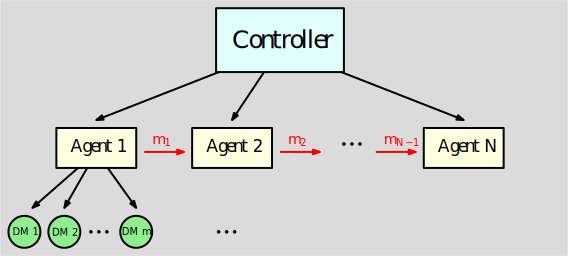
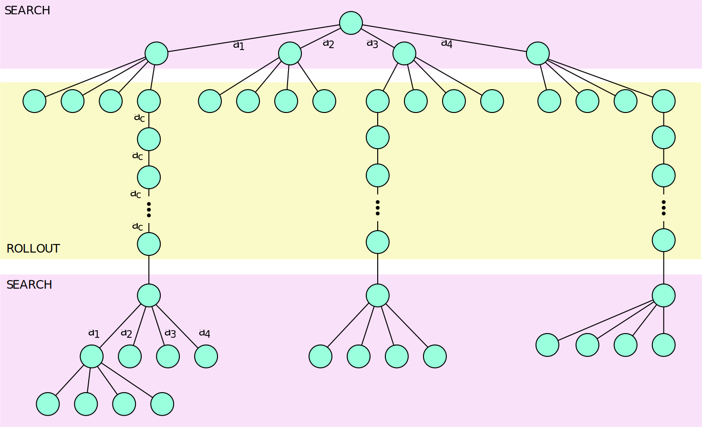
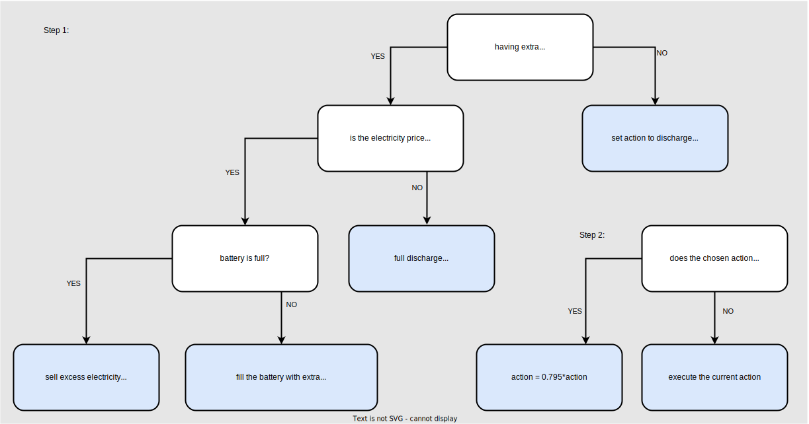
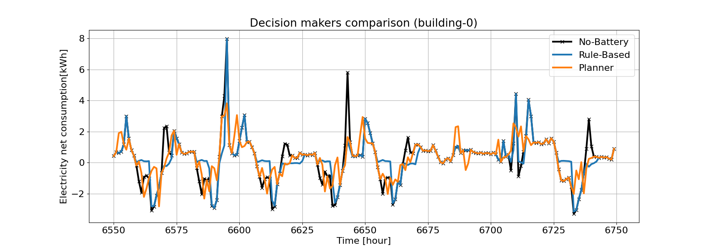
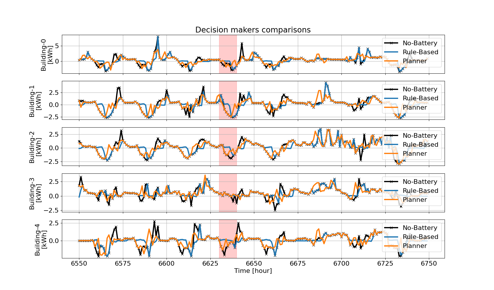
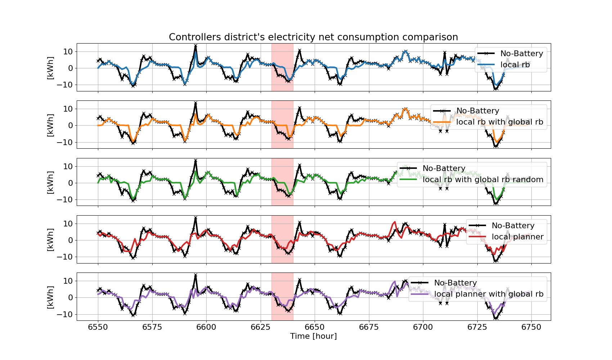
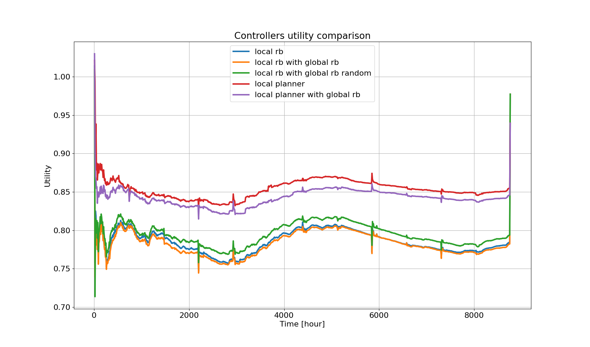

# CityLearn MAD CATS (Multi-Agent Distributed Control with Adequate Tree-Search)

| :exclamation: Disclaimer: This repository is currently under development, so be patient with bugs. :exclamation: |
|------------------------------------------------------------------------------------------------------------------|
 

  

| This repository contains the code for our implementation of a solution for the  [2022 CityLearn challenge](https://github.com/intelligent-environments-lab/CityLearn). |
|------------------------------------------------------------------------------------------------------------------------------------------------------------------------|

Table of Contents:
=================
<!--ts-->
   * [Introduction](#introduction)
   * [Adequate Tree-Search Solution](#adequate-tree-search-solution)
   * [Alternative Rule-Based solution](#alternative-rule-based-solution)
   * [Tunable parameters](#tunable-parameters)
   * [Results analysis](#results-analysis)
   * [Prerequisites](#prerequisites)
   * [Files in the repository](#files-in-the-repository)
   * [Credits](#credits)

## Introduction

The imposed problem is a multi-agent scenario, where the agents are the buildings in the smart grid.
There is a battery in each building, which is used to store energy, residents' load, and a solar panel to produce
energy. Each building has its own energy consumption and production, and the goal is to minimize the utility,
which is a specified measure of the net energy consumption of the buildings in the grid, parts of which are global to
the whole district, while others are local to each building.
The action space for each agent (building) is the amount of energy to be charged/discharged to the battery, which is
continues  in $[-1, 1]$, where $1$ and $-1$ stand for maximally charging and maximally consuming (discharging) the
battery, respectively.
The observation space is the energy consumption and production of the building, as well as additional global parameters
such as the electricity price, the $\text{CO}_2$ intensity per unit of electricity, the weather parameters, etc.

The crux of the problem is that:
- Each building's actions affect its *future* net consumption, so the net consumption of each building has to be
  predicted.
- The utility involves global parts, so the optimal action for one building depends on the actions of the other
  buildings.
- The natural periodicity of the net consumption is 24 hours, which for vanilla planning using tree-search 
  algorithms, even with moderate branching factors, is intractable (e.g., for $5$, one gets
  $5^{24}=6\cdot 10^{16}$ nodes).

## Adequate Tree-Search Solution

The net consumption of the $i$'th building at time $t$ is composed of three key elements:

$$E^{(i,t)} = E_\text{Load}^{(i,t)} + E_\text{Solar}^{(i,t)} + E_\text{Storage}^{(i,t)}$$

The non-shiftable load $E_\text{Load}^{(i,t)}$ and the solar generation $E_\text{Solar}^{(i,t)}$ terms are given from
the environment.
The storage $E_\text{Storage}^{(i,t)}$ is due to the agent's action, which is the amount of energy to be
charged/discharged from the battery.

We can therefore factorize the problem into two sub-environments, one for the agent and one for the "world", where the
actions only affect the agent's environment, and the world's environment dictates the time-evolution.

The actions affect the net electricity consumption via the equation above, and accordingly affect the utility function.

We implement and use:

- Uniform-Cost Search algorithm (a type of tree-search), which is a modified 
[Dijkstra's algorithm](https://en.wikipedia.org/wiki/Dijkstra%27s_algorithm), to find the next optimal action for each
  building.
- Various predictors to predict the net consumption of each building for the next time frame ( $1$ or $24$ h)
- Battery model to translate action to change in battery's state.
- Depth-selective search, where the search is performed only on specified levels of the tree, and the rest is 
  bridged by steps among which the action is uniformly divided.
- Instantaneous approximation of the total utility function that is formally calculated only after complete episode
  (year). Moreover, some of the utility terms are global (affected by the actions of all the buildings in the district).
  However, we use decentralized controllers, where each building takes actions to optimize the local reward function.
  Therefore, a local estimation of the global utility is established and used to guide the search for each agent.
- Residual corrections between the sum of local trajectories and the optimal global behavior are taken care of by the
  last agent. This is done by a simple heuristic, which optimizes a global utility with the sum of net consumptions
  (modified with the planned actions). 

##### Etymology
Let's break down the name of the repository:
MAD CATS (Multi-Agent Distributed Control with Adequate Tree-Search)
- `CityLearn` is the name of the challenge, referring to the fact that there is a collective (city) learning goal.
- `Multi-Agent` is the type of problem that basically refers to the same thing.
- `Distributed Control` refers to the fact that the actions are performed in a distributed manner, 
   i.e., each agent has its own policy and search tree, which is independent of others.
- `Adequate Tree-Search` refers to the uniform-cost tree-search algorithm we use to solve the problem,
   with its extra spices that contribute efficiency, e.g., depth-selective search and non-uniform action space
   discretization, and to the fact that it is based on a battery model we employed, and use mixed decision-makers for
   the decentralized controllers.

### Formulating the Battery problem as an MDP

To use search algorithms such as Uniform-Cost-Search (UCS), we need to have a model of the world as a Markov Decision
Process (MDP) that we can use for offline planning. The given CityLearn environment, as previously mentioned, can be
factored into two parts:
- The **Environment** model, which consists of the weather parameters (e.g. temperature, solar irradiance, etc.), 
  the grid parameters (e.g. electricity price, carbon intensity, etc.) and the buildings' electricity measured data 
  (e.g. non-shiftable load and solar generation).
- The **Battery** model, which consists of the battery's State of Charge (SoC), Capacity, Nominal-Power, and so on.

Therefore, we formulate the model of the battery as an MDP, and together with a predictor that predicts the future 
behavior of the grid and each building's electricity consumption and production, we use UCS to find the best plan of 
battery actions from each state for each building.
  
The battery MDP $\langle S, A, T, R\rangle$ parameters we use are:
- The *state*  $S$ is composed of the battery state (SoC derivative, Soc, and capacity) at time step $t$,
  $s_t  = (SoC_{t} - SoC_{t-1}, SoC_{t}, Capacity_{t})$.
- The *action* $A$ is defined as some discretization of the continuous action space $[-1, 1]$, e.g., 
  $[-1.0, -0.5, -0.1, 0, 0.1, 0.5, 1.0]$.
- The *transition* $T$ is given by the [physical model of the battery](#battery-model), reverse-engineered from the
  CityLearn environment.
- The *reward* $R$ is a [local reward function](#local-utility-estimation) (cost function in our case) which we
  handcrafted to be globally consistent with the original CityLearn's utility. 
  
The goal here is to find a trajectory of battery charge/discharge actions with minimal cost, given a set of environment
predictions, execute the single first or the first few actions from that trajectory, and then re-plan.

#### Timescales in the problem

Before delving into further details, it is important to focus on the different timescales which motivated our solution.

- Each action is taken for a time frame of $1$ hour, and the environment is updated every hour, so this is the immediate
  timescale to predict and act upon.

- The basic operational timescale is the 24-hour cycle, which is the natural periodicity of the net consumption of the
  buildings, as  the generation peak occurs at about noon, and the consumption peak occurs during the evening.
  This timescale is also the timescale of the electricity price and the carbon intensity, which constitute the global
  utility terms.

The gap between these two timescales is the problem's main challenge and is why we are to use tree-search algorithms to
find the optimal action for each building.

- The long-term timescale is the whole year, which is the timescale of the data we have to train our decision-makers on.
  
- Intermediate timescales, like the one-month used in the load factor utility term or the long drifting time of the
  weather, are not considered in our solution, as they are not relevant to the immediate action of the agent.

### Battery model

We reverse-engineered the battery model from the `CityLearn` environment, and used it as the MDP's (Markov decision
process) transition function for the planning as mentioned above.

The key parameters of the model are the battery's capacity, charging/ discharging efficiency, and nominal power.
For a complete mathematical analysis of the battery model used in the CityLearn's environment,
see [battery model analysis](/battery/BATTERY.md).

### Local utility estimation

The utility is a function of the net consumption ( $E$ ), which is only evaluated at the end of the year (episode).
However, the predictions and actions are made at each step, so we need to estimate the utility at each step.
For this purpose, we use an instantaneous utility estimation approximating the original utility.

To motivate the construction of the instantaneous utility function, we first observe it as it's defined in the
CityLearn 2022 challenge environment.

The utility is a weighted sum of four terms: 

$$ U=\frac{1}{3}\frac{P}{P_{0}}+\frac{1}{3}\frac{C}{C_{0}}+\frac{1}{6}\frac{R}{R_{0}}+\frac{1}{6}\frac{L}{L_{0}}, $$

Where $P$ is the district's electricity price cost, $C$ is the district's $\text{CO}_2$ emission, $R$ is the ramping
factor, and $L$ is the load factor. All explained below.
Each term is normalized by the baseline cost (with subscript $0$ ), which is the cost of the district without battery
usage, which is equivalent to consecutive no-op actions.

Next, let us break down each one of the utility terms.

#### Electricity cost:

$$ P=\sum_{t=0}^{8759}\alpha_P (t)\left\lfloor\sum_{t=0}^4 E^{(i,t)}\right\rfloor_0 $$

Here $\alpha_P (t)$ is the electricity price at time $t$ (given from the environment), and $E^{(i,t)}$ is the net
consumption of the $i$'th building at time $t$. The $\left\lfloor\cdot\right\rfloor _{0}$ annotates the positive part
of the sum over all buildings (5 in the training set, but not necessarily 5 in the other sets).

Note that this part of the utility can be directly decomposed into the sum of instantaneous utilities at each
time step (and be rewritten as a dot product). Still, a global knowledge of the district's net consumption is required
to execute the ReLU.

To approximate this global trend, we use a leaky ReLU, where the slope of the negative part is a parameter, which
we set to $\beta_P\approx 0.16$ according to the training set's statistics (without battery usage).

$$ P\approx\sum_{t=0}^{8759}\sum_{t=0}^{4}P^{\left(i,t\right)}\text{ },\quad\text{ with }\quad
\tilde{P}^{\left(i,t\right)}=\alpha_{P}(t)\left(\left\lfloor E^{(i,t)}\right\rfloor_{0}+\beta_{P}\left\lceil
E^{(i,t)}\right\rceil _{0}\right)\text{ }, $$

where $\left\lceil\cdot\right\rceil_{0}$ denotes the negative part.

This approximation only applies to the local utility estimation.

#### Carbon emission:

$$ C=\sum_{t=0}^{8759}\sum_{t=0}^{4}\tilde{C}^{\left(i,t\right)}\text{ },\text{ },\quad\text{ with }\quad
\tilde{C}^{\left(i,t\right)}=\alpha_{C}(t)\left\lfloor E^{(i,t)}\right\rfloor _{0}\text{ }. $$

Here $\alpha_{C}(t)$ is the given carbon intensity at time $t$, and we readily decomposed this term into the sum of
local and instantaneous utilities.

#### Ramping:

$$ R=\sum_{t=0}^{8759}\left|\sum_{i=0}^{4}\left[E^{(i,t)}-E^{(i,t-1)}\right]\right| $$

Similarly to the price term, this part of the utility can be directly decomposed into the sum of instantaneous
 utilities, but a global knowledge of the district's net consumption is required to execute the absolute value.
    
To approximate this, we use a factored ReLU, with a scaling factor $\beta_R\approx 0.75$ set according to the
training set's statistics.

$$R\approx\sum_{t=0}^{8759}\sum_{t=0}^{4}R^{\left(i,t\right)}\text{ },\quad\text{ with }\quad R^{\left(i,t\right)}
=\beta_{R}\left\lfloor E^{(i,t)}-E^{(i,t-1)}\right\rfloor _{0}\text{ }.$$

Once again, this approximation only applies to the local utility estimation.

#### Load factor:

$$ L=1-\frac{1}{8760}\sum_{m=0}^{11}\frac{\Sigma_{t=0}^{729}\Sigma_{i=0}^{4}E^{\left(i,730m+t\right)}}{\max
\left[\Sigma_{i=0}^{4}E^{\left(i,730m+t\right)}\right]_{t=0}^{729}}\text{ }. $$

This is a somewhat cumbersome term, but let's break it down intuitively.
In the numerator, we have a sum of the net consumption over all (730) time-steps of the month $m$, and in the
denominator, we have the maximum (peak) value.
This means that this part of the utility penalizes the peak consumption and rewards the average consumption.
To see this, we observe that wherever action we take, the sum of consumption over a whole month is, more or less,
anyway given by the load-to-generation difference, and the peak consumption is the only thing that the action can affect
due to the relatively small timescale at which the battery can get drained or charged.
So, higher peak consumption means larger denominators, so lower arguments of the summation, but the leading minus
sign in the utility function means that this is penalized the peak values.

To approximate this term, we take a heuristic approach, using the median and max consumption of the no-op
trajectory over each month as a proxy for penalizing high (candidate peak) consumptions.

$$ L\approx\sum_{m=0}^{11}\sum_{t=0}^{729}\sum_{t=0}^{4}\tilde{L}^{\left(i,t,m\right)}\text{ },\text{ },\quad
\text{ with }\quad \tilde{L}^{\left(i,t,m\right)}=\beta_{L}\left[\exp\left(\frac{\left\lfloor
E^{\left(i,730m+t\right)}-\mu_{1/2}^{m}\right\rfloor_0}{M^m-\mu_{1/2}^m}\right)-1\right]\text{ }, $$

where $\mu_{1/2}^m$ is the median of the no-op trajectory over the month $m$, and $M^m$ is its maximum, and
$\beta_L\approx 84$ is a scaling factor set according to the training set's statistics.
The large difference between the scaling factors stems from the different approaches, and also from the fact that the
different terms in the utility are arbitrarily summed over or taken the average of. In part, this scaling factor does
not matter *per se*, as each utility term is normalized by the no-op utility, but it is set to match the original 
utility scale. It is also varied for the global utility estimation.

### Decentralized control scheme with directional information

We use a decentralized control setting for all agents, where each building has its own set of decision-makers.
The last agent is knowledgeable about the rest of the agents (net consumptions modified by the planned actions),
and can use this information to make better decisions in the context of the group.

> Schematic illustration of the decentralized controller architecture in use.

### Depth-selective search

When using tree search algorithms, the search worst-case time complexity reads $b^d$ where $b$ is the branching
factor (the size of the action space) and $d$ is the depth of search (number of time steps in the assessed trajectory).
This  estimation is an upper bound for the case of UCS (with constant weights) because the search is guided by a cost
function $g(n)$. Therefore, for UCS, a better estimation for the time complexity of the algorithm would be
$b^{\frac{C}{\epsilon}}$ where $C$ is the cost of the goal state and $\epsilon$ is the lowest arc cost. 

Usually, UCSs are considered with a clearly defined goal state. This is not the case here as, although using UCS, we do
not look for a goal state. Instead, we optimize the search to reach the environment's correlation depth (natural
periodicity), which is about 24 hours (24 search steps).

The problem is that the search gets intractable even with a moderate branching factor. For example, with $b=5$, we have
$5^{24}\approx 6\cdot 10^{16}$ evaluations, which is impractical even regardless of the limited evaluation time set in
the context of the challenge.

Therefore, to reach search depth of $24$ h, we use a trick we call Depth-Selective Search (DSS). We a priori choose in
which depths we are going to expand the entire action space (search properly), and in which depths we do rollout using
constant or predefined actions $a_c$ (see figure below). The action space for $a_c$ is explored in the last pre-rollout step.

This way, we can expand much deeper trees where we trade off width with depth and reach the interesting
correlations in the environment while easing the burden of the exponential branching barrier.

> Depth Selective Search (DSS) algorithm illustration. We search only in a few selective parts of the tree (yellow),
  while on the other parts (pink), we use rollout with constant predefined actions. 

### Net consumption prediction

As mentioned before, the net consumption is the measure which is used to evaluate the performance of the agents, and is
controlled by them via the battery consumption.
Crucially, the net consumption according to which the action has to be optimized is not the one that is observed by the
agent, but the one of the following time step.
Furthermore, for the tree search we need to predict the net consumption for the next $24$ time steps.

To this end, we implemented several alternative predictors:
- **IDX predictor**: This is the simplest predictor, which predicts the net consumption according to the known time
  index and building number.
- **Dot product**: Generates prediction by finding the maximal dot-product overlap of the past $24$ h consumption and
  training data. It is a simple and fast method, but it does not generalize very well.
- **Multi-Layer Perceptron**: This is a Multi-Layer Perceptron (MLP) network trained to predict the net
  consumption from the last $24$ h history. Its architecture is Time-delayed Neural Net (TDNN), which means that it takes
  the whole history as input, and the output is the prediction for the next 24 time steps at once, without any time
  roll. It features three hidden layers with $128$, $16384$, and $64$ neurons,
  and a ReLU activation function. The network is trained with the Adam optimizer, and the loss function is the mean
  squared error (MSE), with exponential weighting for improving the accuracy at the initial times out of the 24 hours
  output. Given the small dataset, its prediction is not very accurate, but it is a great improvement over the dot
  product.

## Alternative Rule-Based solution
Alternatively, when not using search, we use a set of rules that defines the next move for each building independently
(locally), based on the next hour prediction.
The rules were defined to "flatten" the net consumption curve (closing the temporal gap / phase-shift between 
peak production and peak demand) and, by this, to minimize the utility:
- If the next hour's production is higher than the consumption, the battery is charged by the extra amount.
- If the next hour's consumption exceeds production, the battery is discharged by the missing amount.

The action is also cropped by the available energy (/room) in the battery, and by its nominal power, which limits the
maximal charge/discharge per hour.

On top of that, the rules treat the cases where the battery is fully charged or fully discharged.
We also penalize the battery charge in hours when the carbon intensity is below its median,
as in such times the utility for using the grid power is relatively lower.

The rules are defined in two cases, for a single building and for a group of buildings.
The essence is the same, just that in the latter case, the input is the net consumption of the group.

Additional tuning was done to the rules, to minimize the utility of the training set, and the parameters for the
single and group rules were found to be different.

An important hyperparameter is thus the number of buildings that use the group rules. Namely, shall only the last
building (which is fully knowledgeable) make its decisions based on the district's total net consumption, or shall
more agents (from the end) take altruistic actions?

> Rule-based solution for a single building

## Tunable parameters

Controller parameters:
- `random_order`: Whether to choose the order of the buildings randomly each time-step or not.
- `prediction_method`: The method to use for predicting the net consumption of each building. Choose from:
  - `IDX`: Use the time and building indices for perfect prediction over the training set.
  - `CSV`: Load the predictions from a CSV file.
  - `DOT`: Generate prediction by finding the maximal dot-product overlap of the past $24$ h consumption and training
    data.
  - `MLP`: Predict with Multi-Layer Perceptron, using $24$ h history of net consumption and global variables.
- `agent_type`: The type of decision-maker to use for all agents except the last one ( $N-1$ agents). Choose from:
  - `RB-local`: Use Rule-Based agents.
  - `PLAN-local`: Use the Uniform-Cost Search algorithm.
`last_agent_type`: The type of decision-maker to use for the last agent. Choose from:
  - `RB-local`: Use Rule-Based agent -- *egoistic* decision-maker using only individual net consumption.
  - `RB-global`: Use Rule-Based agent, but with global net consumption -- *altruistic* decision-maker using only
   collective district's net consumption.
  - `PLAN-local`: Use the Uniform-Cost Search algorithm.
  - `PLAN-global`: Use the Uniform-Cost Search algorithm, but with global net consumption. [not implemented]

Planner parameters:
- `search_depths`: list of depths to search to. The gaps are filled with constant action of the last searched depth.
- `max_serach_time`: time to terminate search if not finished, and keep to the best trajectory found by this time.
- `d_action`: the action-space is discrete, so this is the step-size of the action-space.
- `acion_space_list`: list of actions to search over. If `None`, then the action-space is discretized to `d_action`
  steps.
- `utility_weighting`: re-weighting of the different terms in the local utility.

## Results analysis

Here we review some results to highlight the differences between the different methods.

### Decision-makers comparison

We compare the performance of the different decision-makers, and first observe how they affect the net-consumption
trajectory of an individual building and then the whole district.

We pick an arbitrary time frame (6500-6800) and plot the net consumption of the first building in the following
figure (black line), this is the total consumption for the baseline case, where the agents are not allowed to
use their batteries. Namely, performing a series of no-op actions.
The blue line is the net consumption of the same building when it uses its battery, according to the rule-based
solution, and the orange line is the net consumption when the agent uses the search algorithm.

> A comparison of the decision-makers. The net consumption of a **single building** is shown,
  and the actions are taken by the different decision-makers.

We can see that the rule-based solution is able to flatten the net consumption curve at the first dip, where it
charges the battery for few consecutive hours, until it is full and it reduces to the baseline consumption.
The search algorithm, on the other hand, spreads the charge over a longer time frame within the dip.
This is because the search algorithm is able to see the future net consumption, and thus it can charge the battery
more efficiently.
This is also the reason why the search algorithm is able to better compensate the net consumption curve at the first
peak.

Next, we compare the net consumption all the buildings in the district, and we see that this feature is even more
prominent (see, for example, the red-marked dip and following peak).
 

> A comparison of the variation in decision-makers behaviour across different buildings. The net consumption of a
  **single building** is shown, and the actions are taken by the different decision-makers for each building.

We also observe that the general trend of the net consumption is similar for all the buildings, and the differences
are mainly in the high-frequency fluctuations.
We therefore focus on the total net consumption of the district, and plot it in the following figure.

> A comparison of the control configurations. The net consumption of the **whole district** (sum of all building's) is
  shown, and the actions are taken by the different decision-makers in each control configuration: No-op, local
  Rule-Based,local RB with global RB, planners with (or w/o) last global RB.

Here we compare the net consumption of the whole district, with additional control configurations.
The black line is again the baseline, where the agents are not allowed to use their batteries, and the colored
lines are the different control configurations.
The total utilities of the different configurations are provided in the table below.
* Blue is the local Rule-Based solution, where each agent plays egoistically according to the Rule-Based policy.
  This one is similar to the previous figure, but now we get the averaging effect of the district.
* Orange is the local Rule-Based solution with the last agent using the global Rule-Based policy, thus incorporating
  the residual net consumption of the rest of the district (altruism).
  We can see that this configuration is able to flatten the net consumption curve more precisely, and thus
  achieve a utility.
* Green is the same as the orange one, but here we introduce randomization in the order of the buildings, such that
  the last agent is not always the same building, to distribute the altruistic behaviour across the district.
  This configuration results in a slightly higher utility than the previous one, because the coefficients of the 
  rule-based solution were optimized for the specific last building.
* The red line is the local planner, which as in the single building case, is able to exploit the future net
  consumption and flatten the net consumption curve more efficiently.
* The purple line is the local planner with the last agent using the global planner. This hybrid approach
  combines the best of both worlds: the planner is able to consider farther future, and flatten the net
  consumption curve more efficiently for a single building, and the last agent is able to incorporate the residual
  net consumption of the rest of the district using the rule-based solution.

Below we provide the utility of the different configurations as a function of the time throughout the whole year.

> A comparison of the control configurations utilities: No-op, local Rule-Based,local RB with global RB,
  planners with (or w/o) last global RB. 

The colors are the same as in the previous figure, and the black line at $1$ is the baseline, where the agents are not
allowed to use their batteries (no-op), as all other utilities are normalized to this baseline.
We see that all decision-makers are able to achieve a utility considerably lower than the baseline, and that their
trends are similar.
They are "grouped" in two clusters, one for the rule-based solutions, and one for the planners.
Within the rule-based solutions, we observe an improvement of the rule-based solution with global (orange)
over the local one (blue), which is diminished by the randomization of the last agent (green).
The planners achieve a higher utility, probably because their action space is too descretized, and thus they are
able to flatten the net consumption curve less precisely. However, also in this case, we observe an improvement
of the planner with global (purple) over the local one (red).

 
Utilities for these examples:
| Decision-maker | Utility (total) | Price cost | Emission cost | Grid cost |
|----------------|-----------------|------------|---------------|-----------|
| No-op          | 1.000           | 1.000      | 1.000         | 1.000      |
| Local RB       | 0.7845           | 0.721       | 0.7764         | 0.8561    |
| Local RB + global RB | 0.7822           | 0.6858 |  0.8174 | 0.8436    |
| Local RB + global RB + random | 0.7939           | 0.685 | 0.8248  | 0.8718  |
| Local planner  | 0.855           | 0.7708 | 0.8958 | 0.8985     |
| Local planner + global RB | 0.846           | 0.7405 | 0.9391 | 0.8584    |

--------------------------------------------------------------------------------

In what follows, we provide a more detailed analysis of the different decision-makers.

### Planner

Here we focus on the special features of our UCS planner.

#### Depth-selective search

In the figure below, we compare the district's net consumption for the local planner using different depth values for 
the search algorithm. We avoid using the global rule-based decision-maker for the last agent, to preserve the raw
performance of the planner.

 --> three subplots stacked vertically for
`search_depths = {[0,1], [0,1,2,3,4], [0,1,2,3,8]}`.

> A comparison of several search depths for the local planners. The net consumption of the **whole district** (sum of all building's) is
  shown, and the actions are taken by the planners using `[0,1]`, `[0,1,2,3,4]`, and  `[0,1,2,3,8]` search depths (without last global RB).

The `[0,1]` depth planner (blue) cannot exploit information from the future, and thus it is not able to flatten the net
consumption curve as efficiently as the other two.
The `[0,1,2,3,4]` depth planner (orange) is able to flatten the net consumption curve more efficiently, but it is not able
to performa as good as the `[0,1,2,3,8]` depth planner (green), which is able to utilize information from the far future.

#### Utility weighting

Using the same configuration as in the previous figure, we leverage the local utility approximation to weight the different
utilities in the optimization problem. The weights are corresponding to the price, emission, and grid costs, respectively,
where the grid cost is the sum of the ramping and load factors. The input weights we consider are therefore multiplied
by `[1/3, 1/3, 1/6, 1/6]` and normalized to sum to one, such that `[1, 1, 1, 1]` corresponds to the original challenge
weights.

 --> four subplots stacked vertically, three 
corresponding to a different part of the utility (where the grid cost is combined), and the last to the total.
Each panel with four lines for the four `utility_weighting = {[1, 1, 1, 1], [1, 0, 0,0], [0, 1, 0, 0], [0, 0, 1, 1]}`.

> A comparison of different utility weightings for the local planners. The original (environment's) utility is
    shown, and the actions are taken by the planners using `[1, 1, 1, 1]`, `[1, 0, 0, 0]`, `[0, 1, 0, 0]`, and `[0, 0, 1, 1]`
    weightings (without last global RB).

Unsurprisingly, each utility weighting pulls the decision-maker towards its own utility.

The time-averaged utility of the different weightings are:

| Utility weighting | Utility (total) | Price cost | Emission cost | Grid cost |
|-------------------|-----------------|------------|---------------|-----------|
| `[1, 1, 1, 1]`    |                 |            |               |           |
| `[1, 0, 0,0]`     |                 |            |               |           |
| `[0, 1, 0, 0]`    |                 |            |               |           |
| `[0, 0, 1, 1]`    |                 |            |               |           |

#### Agents order shuffling

We consider the effect of shuffling the order of the agents, where the last agent that uses rule-based decision-maker
is randomly selected at each time step to distribute the altruistic behaviour across the district.

 --> two subplots stacked vertically, one for
a single building net consumption, and one for the district's net consumption.
Each panel with three lines for the four `random_order = {True, False}` and no-op.

> A comparison of the effect of shuffling the order of the agents. The net consumption of a **single building** is
  shown (top), and the actions are taken by the planners using `[0,1,2,3,8]` search depth (with last global RB).
  Below, the net consumption of the **whole district** (sum of all building's) is presented.

We observe that the shuffling of the order of the agents each time step introduces a negative effect on the performance,
as the future is "cropped" for the agents whenever they are selected to use as the rule-based altruistic decision-maker.

The total (time-averaged) utility of these two experiments are: 

| Random order | Utility (total) |
|--------------|-----------------|
| `True`       |                 | 
| `False`      |                 | 

### Rule-based

Here we use the special rule-based decision-maker, and focus on the effect of the global decision-maker.
To this end, we avoid agents randomization, and present the egoistic and altruistic behaviours of the last agent 
with and without the global decision-maker, and their effect on the district's net consumption.

| last_agent_type | last building's (4) net consumption                                    | whole district net consumption                                                 |
|-----------------|------------------------------------------------------------------------|--------------------------------------------------------------------------------|
| `RB-local`      |   [makes sense] |                 |
| `RB-global`     |               | [makes sense] |
 

The global decision-maker seems to not take the optimal actions for itself (bottom left compared to top left), but
it is able to flatten the net consumption curve of the whole district (bottom right compared to top right).

### Summary

The rule-based solution at this stage is superior to the planner, as it is able to flatten the net consumption curve more precisely.
However, the special abilities of the planner to incorporate information from the far future, are anticipated to be
able to improve the performance of the planner.
Moreover, we found that synergizing imperfect planners with last RB agent is a beneficial approach, as it is able to
exploit both far future (local) information and the accurate global information required for "polishing" the net consumption curve.
Note that as any planner, this solution is only as good as its function predictor, and thus it is expected to be
able to perform better with an improved one.

## Prerequisites
TODO: update requirements.txt or remove it.
Maybe it will also work without these, and it's enough to refer to the requirements.txt in the main repo.

| Library      | Version |
|--------------|---------|
| `python`     | 3.9.13  |
| `matplotlib` | 3.5.2   |
| `tqdm`       | 4.64.1  |

**plus** the CityLearn package itself, with its dependencies.
Note to get the 1.3.6 version, from:
[https://github.com/intelligent-environments-lab/CityLearn](https://github.com/intelligent-environments-lab/CityLearn)

## Files in the repository

TODO: complete!

| File/ folder name   

| Purpose                                                           |
|---------------------------------|-------------------------------------------------------------------|
| `main.py`                      | main script for locally evaluating the model on the training data |
| `utils.py`                      | utility functions for the main script                             |
| `agents`                        | folder for the agents' modules                                           |
| ├── `battery_model_rb_agent.py` | rule-based agent with a battery model                              |
| ├── `brute_force_day_agent.py`  | planner agent combined with a rule-based agent                              |
| └── `controller.py`             | the multi-agent control class             |
| `battery`                        | folder for the battery model modules                                           |
| ├── `BATTERY.md` | explanation of the battery model |
| ├── `battery_model.py`  | battery model class |
| ├── `env_battery_model.py`  | battery model class as it is written in the CityLearn environment |
| └── `tree_search.py`  | the tree search algorithm (UCS) implementation |
| `data`                        | the CityLearn phase 1 data and the data needed for MLP training and prediction                                           |
| `figures`                        | figures for README files                                           |
| `net_consumption_mlp`  | folder for the MLP implementation                                           |
| `notebooks`  | folder for notebooks collection |
| `predictors`  | folder for predictor modules |
| └── `predictor_wrapper.py`  | a wrapper for the different predictors being used  |
| `rewards`  | folder for reward and utility modules |
| ├── `agent_inst_u.py`  | a local instantaneous utility function approximation module  |
| ├── `agent_inst_u_with_last.py`  | a local and global instantaneous utility function approximation module  |
| ├── `get_reward.py`  | not in use in our implementation but kept for CityLearn compatibility  |
| └── `user_reward.py`  | not in use in our implementation but kept for CityLearn compatibility  |

---

├── `README.md`\
├── `agents` - folder for the agents' modules      \
│   ├── `battery_model_rb_agent.py` - rule-based agent with a battery model   \
│   ├── `brute_force_day_agent.py` - planner agent combined with a rule-based agent    \
│   └── `controller.py` - the multi-agent control class   \
├── `battery` - folder for the battery model modules       \
│   |── `BATTERY.md` - explanation of the battery model \
│   ├── `battery_model.py` - battery model class\
│   ├── `battery_model_new.py` - battery model class (second version)\
│   ├── `env_battery_model.py` - battery model class as it is written in the CityLearn environment \
│   └── `tree_search.py` - the tree search algorithm (UCS) implementation \
├── `data` - the CityLearn phase 1 data and the data needed for MLP training and prediction        \
├── `environment.yml`\
├── `figures` - figures for README files \
├── `main.py` - main script for locally evaluating the model on the training data \
├── `net_consumption_mlp` - folder for the MLP implementation\
│   ├── `data_preprocessing.py` - CityLearn data preprocessor for MLP training\
│   ├── `eval_exp_mlp.py` - MLP evaluator\
│   ├── `main_mlp.py` - main module for MLP training\
│   ├── `mlp_model.py` - the MLP class\
│   ├── `mlp_predictor.py` - a CityLearn MLP-based predictor\
├── `notebooks` - folder for notebooks collection\
├── `predictors` - folder for predictor modules\
│   ├── `check_predictors.py`\
│   ├── `consumption_predictors.py`\
│   └── `predictors_wrapper.py` - a wrapper for the different predictors being used  \
├── `requirements.txt`\
├── `rewards` - folder for reward and utility modules\
│   ├── `agent_inst_u.py` - a local instantaneous utility function approximation module  \
│   ├── `agent_inst_u_with_last.py` - a local and global instantaneous utility function approximation module \
│   ├── `get_reward.py` - not in use in our implementation but kept for CityLearn compatibility \
│   └── `user_reward.py` - not in use in our implementation but kept for CityLearn compatibility \
└── `utils.py` - utility functions for the main script 

---

## References
- **CityLearn challenge**. [https://www.aicrowd.com/challenges
  /neurips-2022-citylearn-challenge](https://www.aicrowd.com/challenges/neurips-2022-citylearn-challenge)

## Credits

This solution and its repository was developed by:

* Gal Ness - gness67{at}gmail.com

* Roy Elkabetz - elkabetzroy{at}gmail.com
