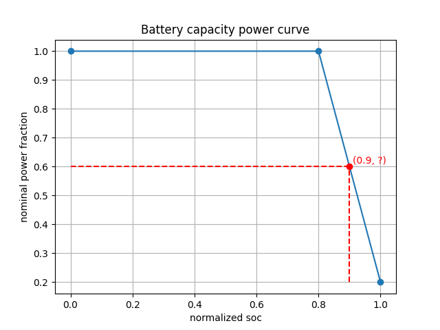
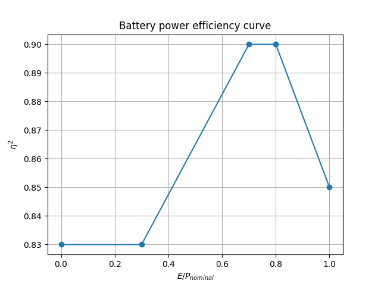

## The Storage Device Model

Understanding the model of the buildings' storage devices used in the environment is very important.
This model will be used in our agent's decision-making process (known as "domain knowledge") instead of using the 
model-free Reinforcement Learning framework, which would be problematic in the current environment due to the lack of
data.

In this section, we describe the storage-device (battery) model as defined in the CityLearn 2022 environment and how it
relates to the agents' actions.

Most of the storage-device model parameters are not part of the input data (e.g., capacity and nominal power).
However, they could easily be computed following a simple action protocol (like taking extreme actions, $a=1$) for a
few time steps (which can be thought of as an informative exploration). 
### Battery model

The authors in Ref. [1] and [2] model a storage device's State-of-charge (SoC) in a continuous time domain using the 
following equation:

$$
\phi(t) = \phi(0) + \frac{1}{C}\int_{0}^{t} P_{Storage}(\tau)d\tau\,,
$$

where $\phi(t)$ is the SoC at time $t$ which is bounded to the interval $[0, 1]$,
$C$ is the device's capacity (in units of energy, i.e., kWh), and $P_{Storage}(\tau)$ is the charge/discharge power
(in units of power, i.e., kW).
Note that in the equation above, the SoC is unitless (because $d\tau$ has units of $\frac{energy}{power}=time$, i.e., hour $[h]$).
In general, depending on the model, SoC may have units of energy or be unitless. The difference between the two cases is a multiplicative capacity factor. 

In the discrete time case, like in the CityLearn challenge (with fixed $1$ hour time steps), the SoC equation can be refactored to:

$$
\phi^{(i,t)} = \phi^{(i,0)} + \frac{1}{C^{(i, t)}}\sum_{\tau = 0}^{t} P^{(i, \tau)}_{Storage}\Delta \tau\,.
$$

Here we also introduced building (agents) indexing, such that the $(i,t)$ index pair corresponds to the $i^{th}$ building at time step $t$. 
In our case $\Delta\tau=1[h]$. 
Furthermore, the capacity of real batteries degrades with time/usage, so its parameter $C$ is required to be time-dependent, 
which is also the case in the CityLearn environment.
An explanation about the capacity degradation of a battery can be found [in this link](https://www.pveducation.org/pvcdrom/battery-characteristics/battery-capacity).

### Charging limiting factors

A battery (storage device) can be charged or discharged with energy (in units of kWh),
which is given as a function of the $i^{th}$ agent's action at time step $t$, $a^{(i, t)}$, and can be written as 

$$
    E^{(i,t)} = 
    \begin{cases}
    \min{\left[a^{(i, t)}\cdot C^{(i,t)}, f(\phi^{(i, t)})\right]} & if\quad  a^{(i, t)}\geq 0\\
    \max{\left[a^{(i, t)}\cdot C^{(i, t)}, -f(\phi^{(i, t)})\right]} & \text{otherwise}
    \end{cases}\,,
$$

where $f$ is a function that limits the amount of energy being charged (discharged) to (from) the battery in a specified time step,
given the battery's nominal-power $P_{nominal}$, current SoC $\phi^{(i, t)}$, and capacity $C^{(i, t)}$.
In other words, $f$ determines the energy limit one can charge (discharge) to (from) the battery at each state of the battery. 

In the CityLearn environment, every building may have a different nominal power for its battery (and also other battery's physical parameters),
while all the buildings share the same $f$, which sets the limit on the fraction of nominal power charge/discharge at each time step
(currently it is the default setting of the environment which could be changed in the future).

The function $f$ in the CityLearn environment is referred to as a `capacity-power-curve`.
A capacity-power-curve is (usually) a measured curve that specifies the battery's power input/output limit for a specific SoC
(or normalized SoC, $\frac{SoC}{C} \in [0, 1]$ which is unitless).
In our case, the capacity power curve in use (for all buildings in phase 1) is the one depicted in the figure below,
which contains three measured data points of `(normalized SoC, nominal-power fraction)`, and a linear interpolation between those points. 

For example, given the curve below, say we would like to compute the power limit, $P_{limit}$
(charge or discharge, in our case, is the same, although in the general case, they could be different),
of the battery when it is $90\%$ fully-charged ( $SoC_{norm} = \frac{SoC}{C}= 0.9$ ).
We can compute it using linear interpolation between the two closest measured points (in blue)to the goal point (in red).
Therefore, using the capacity-power-curve, we can compute the power and energy limits for a specific time step of our battery for each SoC.
Note that the [capacity degradation](#capacity-degradation) and the [charging/discharging efficiency](#charge-discharge-efficiency)
are still need to be considered to evaluate the actual energy transfer limit.

>

> A capacity power curve as it is given in the CityLearn environment.

### Capacity degradation
Next, we present the concept of battery capacity degradation as it is defined in the CityLearn environment. In the given environment, the capacity for each building degrades in time according to the next equation

$$
    C^{(i, t + 1)} = C^{(i, t)} - \delta C^{(i, t)}
$$

where $\delta C^{(i, t)}$ is the degradation of the $i^{th}$ building's battery's capacity at time step $t$ and is given by

$$
    \delta C^{(i, t)} = \epsilon C^{(i, 0)} \frac{\vert E^{(i, t)}\vert}{2C^{(i, t)}}
$$

where $\epsilon$ is the *capacity-loss-coefficient* and is usually a small number (i.e., $1e-5$) and $E^{(i, t)}$ is the charging/discharging energy, which in the CityLearn environment also referred to as the *energy-balance* and can be computed directly from the SoC history as follows

$$
    E^{(i, t)} = 
    \begin{cases}
    \delta\phi^{(i, t)} \cdot (1-L_i) / \eta^{(i, t)} & if\quad \delta\phi^{(i, t)}\geq 0\\
    \delta\phi^{(i, t)} \cdot (1-L_i) \cdot \eta^{(i, t)} & otherwise
    \end{cases}
$$

where $\delta\phi^{(i, t)} \equiv \phi^{(i, t)} - \phi^{(i, t-1)}$ is the last change in the battery's SoC, $L_i$ is the battery's *loss-coefficient* (in our case $L_i = 0$, $\forall i$ in phase 1) and $\eta^{(i, t)}$ is the battery's efficiency (will be explained later). 

The energy balance is the amount of energy that the agent effectively tried to charge (discharge) to (from) the battery before some of it dissipated to heat as a result of $\eta^{(i, t)} \leq 1$. This is why when we compute it from SoC history, we need to cancel the battery efficiency effect by factoring with the inverse efficiency for $\delta\phi^{(i, t)}\geq 0$ (or factoring with the efficiency in case of $\delta\phi^{(i, t)}<0$). 

In general, the capacity degradation of batteries is proportional to the change in SoC and the mean SoC of the battery (see [capacity-loss](https://en.wikipedia.org/wiki/Capacity_loss)).

### Charge/discharge efficiency
The efficiency (also known as technical-efficiency) of the battery is a function of the normalized energy charged (discharged) into (from) the battery. The normalized energy is defined as follows

$$
    E_{norm}^{(i, t)} = \frac{E^{(i, t)}}{P_{nominal}\Delta\tau}
$$

where $E^{(i, t)}$ is the charging energy and $P_{nominal}\Delta\tau$ is the agent's maximal input/output power of the battery. Then, for each normalized energy, the battery's efficiency, $\eta^{(i, t)}$, is determined from the battery's *power-efficiency-curve*, using linear interpolation (and in the case of the CityLearn curve also a $\sqrt{\cdot}$ operation). It is important to note that if $\frac{E^{(i, t)}}{P_{nominal}\Delta\tau}>1$, the energy is clipped such that $\frac{E^{(i, t)}}{P_{nominal}\Delta\tau}=1$, so one can not charge the battery with an amount of energy in the single time frame that is larger than the battery's nominal power.

> A battery power efficiency curve as it is given in the CityLearn environment.

This efficiency then determines how much from the agent's energy command to charge (discharge) is actually being charged (discharged) to (from) the battery, and therefore the current SoC is following from the next expression

$$
    \phi^{(i, t)} =
    \begin{cases}
    \min{\left[\phi^{(i, t-1)} + E^{(i, t)}\cdot\eta^{(i, t)}, C^{(i, t-1)}\right]} & if\quad E^{(i, t)}\geq 0\\
    \max{\left[\phi^{(i, t-1)} + E^{(i, t)}/\eta^{(i, t)}, 0\right]} & otherwise
    \end{cases}
$$

The intuition behind the SoC expression, $\phi^{(i, t)}$, is as follows. First, recall that $0<\eta^{(i, t)}\leq 1, \forall (i, t)$, therefore, when an agent chooses an action which results in $E^{(i, t)}$ amount of energy to charge into the battery, the actual amount of energy being charged is $E^{(i, t)}\cdot\eta^{(i, t)}$ which is smaller than $E^{(i, t)}$. Thus, the amount of energy actually being charged is less than the amount commanded, and the rest transforms into heat. 

The current battery model does not contain a heat-dissipation model, therefore, the uncharged energy, $E^{(i, t)}_{uncharged}=E^{(i, t)}\cdot\left(1-\eta^{(i, t)}\right)$ just disappear. 

Similarly, when the agent consumes an $E^{(i, t)}$ amount of energy from the battery, the actual amount of energy drawn from the battery is $E^{(i, t)}/\eta^{(i, t)}$ which is larger than $E^{(i, t)}$, and results in an amount of $E^{(i, t)}\left(\frac{1}{\eta^{(i, t)}}-1\right)$ energy that transforms to heat.

### Battery model summary
Finally, we model the battery's State-of-Charge (SoC) using the above equations, describing the SoC evolution as a time series of energy charge/discharge operations. 

The amount of energy being charged/discharged at each time step is a function of the agent's operation $a^{(i, t)}$ and the physical properties of the battery, which are the battery's capacity ( $C^{(i, t)}$ ) and nominal-power ( $P^{(i, t)}_{nominal}$ ).

The *capacity-power-curve* together with the nominal-power relation determines the limiting factors on the amount of energy that can be charged/discharged at a single time step (in our case, is one hour). 

Another important parameter of the battery is its efficiency $\eta^{(i, t)}$, which determines the amount of energy actually being charged/discharged given the energy results from the agent's action and the battery's limiting factors. The battery's efficiency is a function of the energy being charged/discharged. Hence, it depends on the agent's action and is usually given in the form of a *power-efficiency-curve* as above. 

## Reference

[1] A multi-agent deep reinforcement learning approach for a distributed energy marketplace in smart grids

[2] Demand responsive dynamic pricing framework for prosumer dominated microgrids using multiagent reinforcement learning
